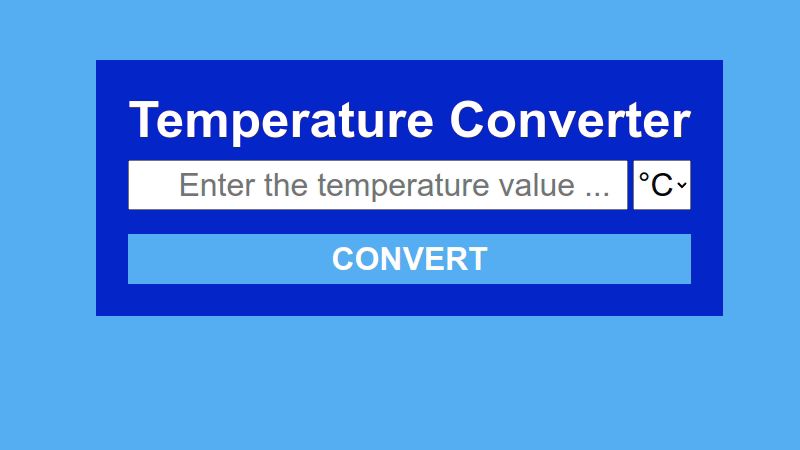

# Temperature Converter

### Implements Client-Server model for a Temperature Converter app.

#### This project works with VUE 3 implementing Composition API in the frontend and NodeJS implementing Express Framework in the backend.

